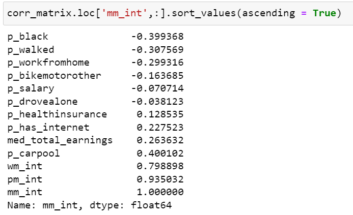

# Houston_Travel_Cost
 Repository location for our group project. 

Andrew Vestal, Elly Atwood, Cameron Medina, Sophia Shuler

## Project Outline
### Project Title: 'Travel Costs: Disparity and it's Causes'

### Summary:

We will look at data and analysis conducted on our subject to paint a picture of what the current consensus on cost of travel is within the city of Houston, Texas. We plan to find a finite value for cost of travel from specific areas or average cost of travel within a city or state, to which we can compare our prediction model against.

**Inspiration for subject:**

There are several studies which have looked into the effects of long commute times, and several have found that longer commute times have been associated with things such as sleep, behavioral, and health problems. We wanted to be able to look into what groups of people are more likely to have longer commute times, making them more susceptible to health problems.

**Planned methodology and approach:**

Determine an abstract of what our cost of travel will encompass. We will look into gender differences in cost of travel to which we gauge all other features' importance in our prediction model. Our objective is to determine what personal factors influence the travel time of individuals in Houston in order to illustrate what groups primarily shoulder the burden of long commute times and their associated side effects. With this data we hope to provide a greater understanding of what groups are at a disadvantage because of their proximity to their jobs. We will produce a model using potentially relevant variables such as race, means of transportation, or salary in order to answer our research question. 

### Expected Outcomes:

'To create predictions with our machine learning model that show close results to our related metric we use to determine cost of commute. Though we don’t expect perfect results, our goal is to create something that gets close. If our model holds, we can possibly determine areas or individuals that require more infrastructure and better means for travel.'

### Dataset Variables:

https://api.census.gov/data/2019/acs/acs5/variables.html
- Means of transportation to work by occupation 
    - car, truck, or van - drove alone
    - car, truck, or van - carpooled
    - public transportation
    - walked
    - taxicab, bicycle, motorcycle, or other
    - worked from home
- Median earnings in the past 12 months by sex for population 16 years and older
- Sex by age
- Presence and type of internet subscriptions in household
- Wage or salary income in the past 12 months for households
- Health insurance coverage status and type by age by educational attainment

### Tools and packages we need:
- Pandas
- GeoPandas
- NumPy
- SkyLearn
- MatPlotLibrary
- Shapely

### Conclusion and Visualizations:

**Total Correlation Matrix**

**Men's Correlation Matrix**

**Women's Correlation Matrix**

**Histogram of Correlation to Variables**

**Total Population Histogram by Tract**

**Men's Histogram by Tract**

**Women's Histogram by Tract**

**Total Aggregate Hours Pie Chart**

**Total People Polled Pie Chart**

**Regression Line with Model Fit Points**

**Regression Table**

#### References:
Block, Eryn Piper, et al. “Early Child Development, Residential Crowding, and Commute Time in 8 US States, 2010–2017.” American Journal of Public Health, vol. 108, no. 11, 2018, pp. 1550–1557. 

Kim, Soojin, Yangwook Kim, Sung-Shil Lim, Jae-Hong Ryoo, and Jin-Ha Yoon. "Long Commute Time and Sleep Problems with Gender Difference in Work–Life Balance: A Cross-sectional Study of More than 25,000 Workers." Safety and Health at Work 10.4 (2019): 470-75. Web.

Kuenn, Annemarie. "Does Commuting Affect Health?" Health Economics 25.8 (2016): 984-1004. Web.

Macleod, Kara E., et al. “Association between Vehicle Time during Pregnancy and Mental Health among Women of Different Income Groups.” Journal of Transport and Health, Elsevier Publishing, 1 Jan. 1970

#### Articles: 
https://www.nytimes.com/2015/05/07/upshot/transportation-emerges-as-crucial-to-escaping-poverty.html#:~:text=In%20a%20large%2C%20continuing%20study,there%20moving%20up%20the%20ladder.

https://nationalequityatlas.org/indicators/Commute_time#/

https://blog.arlingtontransportationpartners.com/what-are-your-employees-commutes-costing-you

https://www.metromile.com/blog/the-true-cost-of-commuting/

https://www.lendingtree.com/auto/cost-of-commuting/
